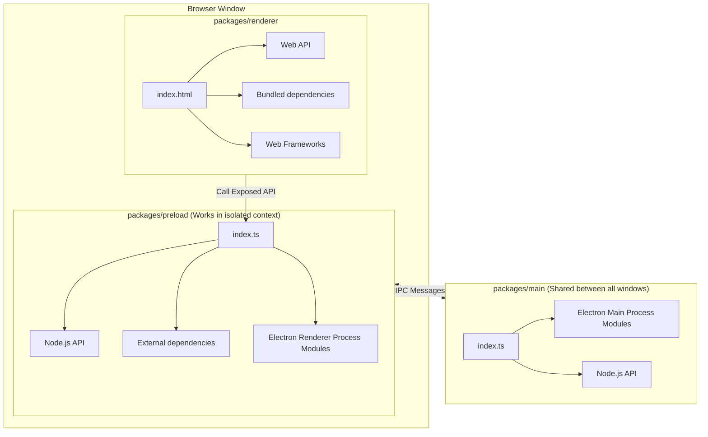
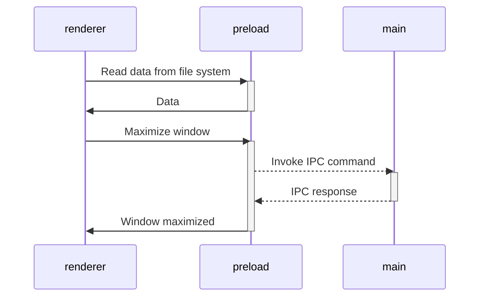

> [!Important]
> This project is maintained by **developer from Ukraine** 🇺🇦
>
> Due to the ongoing war resulting from Russia's full-scale invasion of Ukraine,
> I currently lack the time for the full development of this open-source project.
> My primary focus is on ensuring the well-being of myself and my family.
> 
> I'll prioritize and review all new contributions as soon as possible.
>
> If you can, please consider [supporting Ukraine](https://stand-with-ukraine.pp.ua/) or [me personally](https://www.buymeacoffee.com/kozack).
>
> Thank you for your understanding and support.
---

# Vite Electron Builder Boilerplate

This is a template for secure electron applications. Written following the latest safety requirements, recommendations
and best practices.

Under the hood is [Vite] — A next-generation blazing fast bundler, and [electron-builder] for packaging.

## Get started

Follow these steps to get started with the template:

1. Click the **[Use this template](https://github.com/cawa-93/vite-electron-builder/generate)** button (you must be
   logged in) or just clone this repo.
2. _Optional_: Run `git config core.hooksPath .git-hooks` if you want to enable local pre-commit checks.

That's all you need. 😉

❤️ **If you like this template, give a ⭐ or [send support](https://www.buymeacoffee.com/kozack/)!**

## Tech Stack

### Electron [][electron]

- This template uses the latest electron version with all the latest security patches.
- The architecture of the application is built according to the
  security [guides](https://www.electronjs.org/docs/tutorial/security) and best practices.
- The latest version of the [electron-builder] is used to package the application.

### Vite [][vite]

- [Vite] is used to bundle all source codes. It's an extremely fast bundler, that has a vast array of amazing features.
  You can learn more about how it is arranged in [this](https://www.youtube.com/watch?v=xXrhg26VCSc) video.
- Vite [supports](https://vitejs.dev/guide/env-and-mode.html) reading `.env` files. You can also specify the types of
  your environment variables in [`types/env.d.ts`](types/env.d.ts).
- Automatic hot-reloads for the `Main` and `Renderer` processes.

Vite provides many useful features, such as: `TypeScript`, `TSX/JSX`, `CSS/JSON Importing`, `CSS Modules`
, `Web Assembly` and much more.

> [See all Vite features](https://vitejs.dev/guide/features.html).

### TypeScript [][typescript] (optional)

- The latest version of TypeScript is used for all the source code.
- **Vite** supports TypeScript out of the box. However, it does not support type checking.
- Code formatting rules follow the latest TypeScript recommendations and best practices thanks
  to [@typescript-eslint/eslint-plugin](https://www.npmjs.com/package/@typescript-eslint/eslint-plugin).

> [Guide to disable typescript and remove dependencies](https://github.com/cawa-93/vite-electron-builder/discussions/339)

### Vue [][vue] (optional)

- By default, web pages are built using [Vue]. 
  However, you can change that. 
  Or not use additional frameworks at all.
- Code formatting rules follow the latest Vue recommendations and best practices thanks to [eslint-plugin-vue].

> [!TIP]
> Find more forks 🔱 for other frameworks or setups on [discussions](https://github.com/cawa-93/vite-electron-builder/discussions/categories/forks)

## Features

### Automatic tests
Automatic tests for each commit and Pull Request
- Unit tests are placed within each package and are ran separately. Implemented by [vitest].
- End-to-end tests are placed in the root [`tests`](tests) directory and use [playwright].

### Continuous Integration

- The configured workflow will check the types for each push and PR.
- The configured workflow will check the code style for each push and PR.
- Code signing supported. See [`release` workflow](.github/workflows/release.yml).

### Auto-update
Each time you push changes to the `main` branch, the [`release`](.github/workflows/release.yml) workflow starts,
which creates a new draft release.
For each next commit will be created and replaced artifacts.
That way you will always have draft with the latest artifacts, and the release can be published once it is ready.

> [!TIP]
> This template is configured only for GitHub public
> repository, but electron-builder also supports other update distribution servers.
> Find more in [electron-builder docs](https://www.electron.build/configuration/publish).

## How it works

The template requires a minimum number of [dependencies](package.json).
Only **Vite** is used for building, nothing more.

### Project Structure

The structure of this template is very similar to a monorepo.
The entire source code of the project is divided into three modules (packages) that are each bundled independently:

- [`packages/renderer`](packages/renderer). Responsible for the contents of the application window. In fact, it is a
  regular web application. In developer mode, you can even open it in a browser. The development and build process is
  the same as for classic web applications. Access to low-level API electrons or Node.js is done through the _preload_
  layer.
- [`packages/preload`](packages/preload).
  Contain Electron [**preload scripts**](https://www.electronjs.org/docs/latest/tutorial/tutorial-preload). 
  Acts as an intermediate bridge between the
  _renderer_ process and the API
  exposed by electron and Node.js. Runs in an _isolated browser context_, but has direct access to the full Node.js
  functionality.
- [`packages/main`](packages/main)
  Contain Electron [**main script**](https://www.electronjs.org/docs/tutorial/quick-start#create-the-main-script-file).
  This is the main process that powers the application.
  It manages to create and handling the spawned BrowserWindow, setting and
  enforcing secure permissions and request handlers.
  You can also configure it to do much more as per your need, such
  as logging, reporting statistics and health status among others.

Schematically, the structure of the application and the method of communication between packages can be depicted as
follows:



### Build web resources

The `main` and `preload` packages are built in [library mode](https://vitejs.dev/guide/build.html#library-mode) as it is
simple JavaScript.
The `renderer` package builds as a regular web app.

### Compile App

The next step is to package a "ready to distribute" Electron app for macOS, Windows and Linux with "auto update" support
out of the box.

To do this, use [electron-builder]:

- Using the npm script `compile`: This script is configured to compile the application as quickly as possible. It is not
  ready for distribution, it is compiled only for the current platform and is used for debugging.
- Using GitHub Actions: The application is compiled for any platform and ready-to-distribute files are automatically
  added as a draft to the GitHub releases page.

### Working with dependencies

Because the `renderer` works and builds like a _regular web application_, you can only use dependencies that support the
browser or compile to a browser-friendly format.

This means that in the `renderer` you are free to use any frontend dependencies such as Vue, React, lodash, axios and so
on. However, you _CANNOT_ use any native Node.js APIs, such as, `systeminformation`. These APIs are _only_ available in
a Node.js runtime environment and will cause your application to crash if used in the `renderer` layer. Instead, if you
need access to Node.js runtime APIs in your frontend, export a function form the `preload` package.

All dependencies that require Node.js api can be used in
the [`preload` script](https://www.electronjs.org/docs/latest/tutorial/process-model#preload-scripts).

#### Expose in the main world

Here is an example. Let's say you need to read some data from the file system or database in the renderer.

In the preload context, create a function that reads and returns data. To make the function announced in the preload
available in the render, you usually need to call
the [`electron.contextBridge.exposeInMainWorld`](https://www.electronjs.org/ru/docs/latest/api/context-bridge).

However, this template is designed to use all power of ES modules.
You can import anything from `preload` in `renderer`.
All the data will quietly throw through the `electron.contextBridge.exposeInMainWorld()`,
so you don't need to worry about it.

```ts
// preload/src/index.ts
import {readFile} from 'node:fs/promises';

// Encapsulate types if you use typescript
interface UserData {
  prop: string
}

// Will call `electron.contextBridge.exposeInMainWorld(EXPOSED_PREFIX + 'getUserData', getUserData)`
export function getUserData(): Promise<UserData> {
  return readFile('/path/to/file/in/user/filesystem.json', {encoding: 'utf8'}).then(JSON.parse);
}
```

Now you can import and call the method in renderer

```ts
// renderer/src/anywere/component.ts
import {getUserData} from '@vite-electron-builder/preload'

// Method will came from exposed context
// const userData = globalThis[EXPOSED_PREFIX + 'getUserData']
const userData = await getUserData()
```

> [!TIP] 
> Find more in [Context Isolation tutorial](https://www.electronjs.org/docs/tutorial/context-isolation#security-considerations).

### Working with Electron API

Although the preload has access to all of Node.js API, it **still runs in the BrowserWindow context**, so only limited
electron modules are available in it.

> [!TIP]
> Check the [electron docs](https://www.electronjs.org/ru/docs/latest/api/clipboard) for the full list of available methods.

All other electron methods can be invoked in the `main`.

As a result, the architecture of interaction between all modules is as follows:



> [!TIP]
> Find more in [Inter-Process Communication tutorial](https://www.electronjs.org/docs/latest/tutorial/ipc).

### Modes and Environment Variables

All environment variables are set as part of the `import.meta`, so you can access them vie the following
way: `import.meta.env`.

> [!NOTE]
> If you are using TypeScript and want to get code completion,
> you must add all the environment variables to the [`ImportMetaEnv` in `types/env.d.ts`](types/env.d.ts).

The mode option is used to specify the value of `import.meta.env.MODE` and the corresponding environment variables files
that need to be loaded.

By default, there are two modes:

- `production` is used by default
- `development` is used by `npm run watch` script

When running the build script, the environment variables are loaded from the following files in your project root:

```
.env                # loaded in all cases
.env.local          # loaded in all cases, ignored by git
.env.[mode]         # only loaded in specified env mode
.env.[mode].local   # only loaded in specified env mode, ignored by git
```

> [!WARNING]
> To prevent accidentally leaking env variables to the client, only variables prefixed with `VITE_` are exposed to your
> Vite-processed code.

For example, let's take the following `.env` file:

```
DB_PASSWORD=foobar
VITE_SOME_KEY=123
```

Only `VITE_SOME_KEY` will be exposed as `import.meta.env.VITE_SOME_KEY` to your client source code, but `DB_PASSWORD`
will not.

> [!TIP]
> You can change that prefix or add another. See [`envPrefix`](https://vitejs.dev/config/shared-options.html#envprefix).

## Contribution

See [Contributing Guide](contributing.md).


[vite]: https://github.com/vitejs/vite/

[electron]: https://github.com/electron/electron

[electron-builder]: https://github.com/electron-userland/electron-builder

[vue]: https://github.com/vuejs/vue-next

[vue-router]: https://github.com/vuejs/vue-router-next/

[typescript]: https://github.com/microsoft/TypeScript/

[playwright]: https://playwright.dev

[vitest]: https://vitest.dev

[vue-tsc]: https://github.com/johnsoncodehk/vue-tsc

[eslint-plugin-vue]: https://github.com/vuejs/eslint-plugin-vue

[cawa-93-github]: https://github.com/cawa-93/

[cawa-93-sponsor]: https://www.patreon.com/Kozack/
